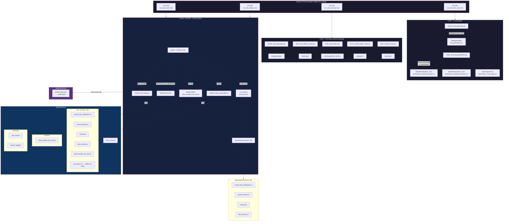

# Atlas Pipeline Reference

> **Last updated:** 2026-03-31 — reflects production codebase after dead-code cleanup.

---

## Entry Points

| Command | Purpose |
|---|---|
| `python -m Atlas.cli live` | Production live run (fetches fresh data, scores, publishes) |
| `python -m Atlas.cli replay --raw <path>` | Deterministic replay from pinned raw JSON |
| `python -m Atlas.cli tools list` | List available tools |
| `python -m Atlas.cli tools run <name>` | Run a registered tool |

CLI is defined in `src/Atlas/cli.py`. It delegates to `src/Atlas/runtime/orchestrator.py` for the actual pipeline.

---

## Pipeline Stages (in execution order)

The orchestrator (`src/Atlas/runtime/orchestrator.py` → `run_today()`) executes these stages:

### Stage 1 — Fetch Raw Board
- **Live:** Fetches PrizePicks API → writes `data/board/fetch_board.csv`.
- **Replay:** Loads pinned raw JSON from `--raw` path.
- No-slate check: if `fetch_board.csv` has zero data rows, exit cleanly.

### Stage 1b — Refresh Game Logs
- **Live only** (skipped in replay): Calls `tools/refresh_nba_gamelogs.py` to update
  `data/gamelogs/nba_gamelogs.csv` with recent box scores.

### Stage 2 — Rebuild today.csv
- Converts raw board into the canonical `data/board/today.csv` that the scoring kernel reads.
- Sets `ATLAS_GAME_DATE` env var from board data or local time.

### Stage 2a.5 — Fetch Role Metrics Snapshot
- Fetches external role metrics (VORP, plus/minus, usage projections) when configured.
- Writes snapshot to `data/output/dashboard/role_metrics_latest.json`.

### Stage 2b — Fetch Rotowire Lines
- Fetches spreads and game totals → `data/input/rotowire_lines.json`.
- Validates date match against `ATLAS_GAME_DATE`.
- **Replay:** Uses pinned Rotowire snapshot.

### Stage 2c — Fetch BettingPros Props
- External consensus lines → `data/input/external_priors_today.csv`.
- Used as bounded priors (cap=0.03, scale=3.0) during optimization.

### Stage 2d — Freeze IAEL Snapshot
- Captures the injury state for the run (invalidations + status + normalized snapshot).
- This snapshot is immutable for the rest of the run.

### Stage 3 — Build Share Matrix
- Calls `tools/build_share_matrix.py` → writes `data/model/share_matrix.csv`.
- Uses `src/Atlas/model/team_share_allocator_v2.py` to compute redistribution weights
  from game logs.
- Must run **before** model scoring (kernel reads the matrix).

### Stage 3 (continued) — Model Scoring (`model_all`)
- Invokes `src/Atlas/engine/main.py` which:
  1. Loads `config.yaml`, `today.csv`, game logs, injury data, share matrix.
  2. Calls `_run_score_board_new()` from `src/Atlas/engine/new_engine.py`.
  3. Inside the kernel: for each leg, calls `simulate_leg_probability_new()`
     from `src/Atlas/engine/new_probability.py`.
  4. Applies role context (share matrix lookup → `role_ctx_mult`).
  5. Applies blowout adjustment → `p_adj`.
  6. Applies under-relief for qualifying UNDER legs.
  7. Runs post-hoc GBM ensemble calibration (`calibration.py`).
  8. Writes `scored_legs.csv` and `scored_legs_deduped.csv`.
  9. Runs telemetry calibration overlay (`telemetry_calibration.py`).
  10. Calls `build_slips_today()` → System, Windfall, DemonHunter slips.
  11. Calls `run_publish_stage()` → writes run directory + latest surfaces.

### Stage 4 — Post-Run
- Fingerprints output artifacts (sha256, row counts).
- Writes bundle zip to `data/bundles/` (optional).
- Emits run_end event to audit log.

---

## Source Code Map

```
src/Atlas/
├── cli.py                          # CLI entry point (live/replay/tools)
├── __init__.py
├── core/                           # Shared utilities
│   ├── dedupe.py                   # Leg deduplication
│   ├── external_priors.py          # BettingPros prior integration
│   ├── features.py                 # Feature engineering for GBM
│   ├── iael_filter.py              # Injury filtering
│   ├── matchup_enricher.py         # Matchup context enrichment
│   ├── minutes.py                  # Blowout adjustment & minutes sensitivity
│   ├── payout_tables.py            # PrizePicks tier payout structure
│   ├── pp_pricing.py               # PrizePicks pricing model
│   ├── share_name_key.py           # Canonical player name normalization
│   ├── slip_builders.py            # Slip construction (system/windfall/demonhunter)
│   └── slip_scoring.py             # Slip-level scoring and EV calculation
├── engine/                         # Scoring engine
│   ├── api.py                      # EngineOutputs dataclass
│   ├── calibration.py              # GBM ensemble calibrator
│   ├── calibration_map.py          # Telemetry calibration overlay
│   ├── main.py                     # Main pipeline (load → score → calibrate → build → publish)
│   ├── new_engine.py               # v9d scoring kernel entry point
│   └── new_probability.py          # Monte Carlo probability + role context
├── model/                          # Model artifacts and builders
│   ├── share_matrix_builder_v2.py  # Share matrix construction
│   ├── share_matrix_contract.py    # Required column contract
│   └── team_share_allocator_v2.py  # Injury redistribution allocator
├── runtime/                        # Execution infrastructure
│   ├── archive_writer.py           # Archive management
│   ├── bundles.py                  # Bundle zip creation
│   ├── obs.py                      # Observability (events, timers)
│   ├── orchestrator.py             # Pipeline orchestrator (run_today)
│   ├── paths.py                    # Path resolution
│   ├── replay_eval.py              # Replay evaluation (eval_legs, Brier)
│   ├── run_context.py              # Run context management
│   └── telemetry_calibration.py    # Isotonic calibration training/application
├── stages/                         # Pipeline stage implementations
│   ├── engine_boundary/            # Engine plan builders
│   ├── fetch/                      # Data fetchers (board, rotowire, etc.)
│   ├── filter/                     # Pre-score filters
│   ├── optimize/                   # Slip building
│   │   └── build_slips_today.py    # BuiltSlips dataclass + slip orchestration
│   ├── prep_for_optimizer/         # Pre-optimizer data prep
│   ├── publish/                    # Output publishing
│   │   └── publish_run_outputs.py  # Write run artifacts
│   ├── rebuild/                    # today.csv reconstruction
│   └── score/                      # Scoring stage wrappers
└── contracts/                      # Interface contracts

tools/                              # Standalone tools
├── build_share_matrix.py           # Share matrix builder (called by orchestrator)
├── oracle_tuner.py                 # Oracle diagnostic / tuner
├── refresh_nba_gamelogs.py         # Game log updater
├── replay_bundle.py                # Bundle replay tool
└── ...
```

---

## Live vs Replay

| Aspect | Live | Replay |
|---|---|---|
| Data source | Fresh API fetch | Pinned raw JSON + archived artifacts |
| Output root | `data/output/runs/<timestamp>` | `data/telemetry/replay_runs/<run_id>` |
| Injury source | Live IAEL refresh | Pinned IAEL snapshot |
| Publishes latest? | Yes | No |
| Game log refresh | Yes | No |
| Missing artifact | Fetch or fail | Hard stop |

### Replay Command

```powershell
python -m Atlas.cli replay --raw data\raw\prizepicks_YYYYMMDD_HHMMSS.json
```

For strict replay with pinned artifacts:
```powershell
$env:ATLAS_STRICT_REPLAY = "1"
$env:ATLAS_IAEL_INVALIDATIONS_PATH = "data\archives\iael\2026\<date>\<ts>\injury_invalidations.json"
$env:ATLAS_IAEL_STATUS_PATH = "data\archives\iael\2026\<date>\<ts>\status.json"
$env:ATLAS_ROTOWIRE_LINES_PATH = "data\archives\iael\2026\<date>\<ts>\rotowire_lines.json"
```

### Bundle Replay

```powershell
python tools/replay_bundle.py <bundle.zip> --scenario-id <name>
```

Bundles are self-contained zips in `data/bundles/` containing the raw JSON, IAEL snapshots,
and Rotowire data needed to fully reproduce a run.

---

## Environment Variables

| Variable | Purpose |
|---|---|
| `ATLAS_STRICT_REPLAY` | `1` = strict replay mode (no live fetches) |
| `ATLAS_GAME_DATE` | Override game date (YYYY-MM-DD) |
| `ATLAS_CONFIG_PATH` | Override config.yaml path |
| `ATLAS_DATA_DIR` | Override data directory root |
| `ATLAS_OUT_DIR` | Override output directory |
| `ATLAS_BOARD_PATH` | Override board CSV path |
| `ATLAS_IAEL_INVALIDATIONS_PATH` | Pinned injury invalidations JSON |
| `ATLAS_IAEL_STATUS_PATH` | Pinned injury status JSON |
| `ATLAS_IAEL_NORMALIZED_PATH` | Pinned normalized injury snapshot |
| `ATLAS_ROTOWIRE_LINES_PATH` | Pinned Rotowire lines JSON |
| `ATLAS_ROLE_METRICS_PATH` | Pinned role metrics JSON |
| `ATLAS_FS_ENFORCE` | `warn` or `hard` — filesystem write enforcement |

---

## Daily Automation & Telemetry Archive

Four Windows Task Scheduler jobs run daily (all wake from sleep):



### Telemetry Archive — What Goes Where

Every live run (manual or scheduled) triggers `_archive_run_to_telemetry()` in `cli.py`, which copies:

| Artifact | Source | Destination |
|---|---|---|
| `scored_legs_deduped.csv` | `data/output/runs/{run_id}/` | `data/telemetry/live_runs/{run_id}/` |
| `scored_board.csv` | `data/output/runs/{run_id}/` | `data/telemetry/live_runs/{run_id}/` |
| `meta.json` | `data/output/runs/{run_id}/` | `data/telemetry/live_runs/{run_id}/` |
| `slip_results.csv` | `data/output/runs/{run_id}/` | `data/telemetry/live_runs/{run_id}/` |
| `atlas_bundle_{run_id}.zip` | `data/bundles/` | `data/telemetry/live_runs/{run_id}/` + `data/telemetry/bundles/` |
| `eval_legs.csv` | Written by 6 AM job | `data/telemetry/live_runs/{run_id}/` + `data/output/runs/{run_id}/` |

### Task Scheduler Settings

All tasks use XML definitions in `scripts/task_*.xml` with:
- **WakeToRun:** `true` — wakes the PC from sleep
- **StartWhenAvailable:** `true` — runs on next boot if missed
- **DisallowStartIfOnBatteries:** `false`
- **RunOnlyIfNetworkAvailable:** `true`

Query tasks: `schtasks /query /tn "Atlas\*"`
