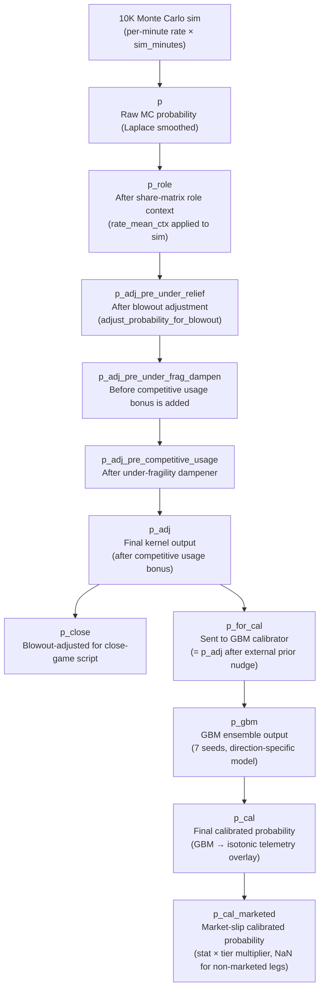

# scored_legs_deduped.csv — Data Dictionary

Every column produced by the Atlas engine for the deduped optimizer-ready leg surface.
Source: `data/output/runs/{run_id}/scored_legs_deduped.csv` — 184 columns as of v17.
Truth labels (`hit`) are **not** present here; they are joined from gamelogs via `replay_eval.py`.

---

## Probability Chain Overview

---

## 1 — Identity & Board

| Column | Type | Description |
|---|---|---|
| `projection_id` | str | PrizePicks canonical projection UUID for this leg offering |
| `source_projection_id` | str | Original upstream projection ID before any normalization |
| `game_id` | str | PrizePicks game ID linking the player's game for this slate |
| `game_date` | date | Scheduled game date (`YYYY-MM-DD`) |
| `home` | int/bool | `1` if the player's team is the home team, `0` otherwise |
| `opp` | str | Opponent team abbreviation |
| `player_key` | str | Normalized join key for the player (lowercased, diacritic-stripped, used for gamelog matching) |
| `player` | str | Player name as it appears on the PrizePicks board |
| `team` | str | Player's team abbreviation |
| `stat` | str | Canonical stat code used internally (`PTS`, `REB`, `AST`, `FG3M`, `PRA`, `PR`, `PA`, `RA`, `FTA`) |
| `stat_raw` | str | Stat label exactly as received from PrizePicks before canonicalization |
| `stat_is_canonical` | int | `1` if `stat` matched a known canon code; `0` if it was aliased or mapped |

---

## 2 — Line & Market

| Column | Type | Description |
|---|---|---|
| `line` | float | The prop line threshold to exceed (OVER) or stay under (UNDER) |
| `direction` | str | `OVER` or `UNDER` |
| `tier` | str | PrizePicks multiplier tier: `GOBLIN` (lowest), `STANDARD`, or `DEMON` (highest) |
| `more_allowed` | int | `1` if the OVER direction is offered for this projection |
| `less_allowed` | int | `1` if the UNDER direction is offered for this projection |
| `main_line` | float | The primary (non-alternate) line for this player/stat |
| `alt_line` | float | Alternate line value if this is an alt-line offering; NaN if main |
| `is_main` | int | `1` if this leg uses the main line; `0` if it is an alt line |
| `odds_type` | str | PrizePicks offering type (e.g. `power_play`, `flex_play`) |
| `start_time` | str | Scheduled game tip-off time (ISO 8601, local) |
| `updated_at` | str | Timestamp of the last board refresh for this projection |

---

## 3 — Spread Inputs

| Column | Type | Description |
|---|---|---|
| `spread` | float | Game spread used by the kernel (positive = home favored). Primary blowout input. |
| `home_team` | str | Home team abbreviation |
| `away_team` | str | Away team abbreviation |
| `home_spread` | float | Spread from the home team's perspective (negative = home favorite) |
| `away_spread` | float | Spread from the away team's perspective (positive = away underdog) |
| `game_spread` | float | Absolute value of the spread (size of the line regardless of side) |
| `rotowire_game_spread` | float | Game spread as sourced specifically from the Rotowire feed (may differ from `spread` if OddsAPI takes precedence) |
| `spread_source` | str | Which source populated `spread`: `rotowire`, `oddsapi`, `board`, or `default` |
| `spread_ok` | int | `1` if a real spread was resolved; `0` if the spread fell back to a default |
| `spread_reason` | str | Human-readable explanation of how `spread` was selected or why it defaulted |

---

## 4 — Minutes & Sensitivity

| Column | Type | Description |
|---|---|---|
| `minutes_s` | float | Stat-specific minutes sensitivity $s \in [0.30, 1.00]$. `PTS/PRA/PA/PR/RA` → 1.00; `REB/AST` → 0.70; `FG3M` → 0.45; `STL/BLK` → 0.30. Used to scale blowout risk into probability adjustment. |
| `minutes_s_blowout` | float | Effective sensitivity used inside the blowout adjustment (may be modified by config rules) |
| `minutes_s_close` | float | Sensitivity used for the close-game channel probability (`p_close`) |
| `min_mean` | float | Mean minutes played over the gamelog window for this player |
| `min_std` | float | Standard deviation of minutes over the gamelog window |

---

## 5 — Raw Probability Chain

### 5.1 Monte Carlo kernel output

| Column | Type | Description |
|---|---|---|
| `p` | float | Raw MC probability. $p = \frac{\sum hits + 0.5}{N + 1.0}$ (Laplace smoothed from 10 K simulations). No role context, no blowout. |
| `p_role` | float | Probability after share-matrix role context. The per-minute rate `rate_mean` is multiplied by `role_ctx_rate_mult` before the MC sim runs; the resulting shift propagates into $p$. |
| `p_adj_pre_under_relief` | float | $p$ after blowout adjustment via `adjust_probability_for_blowout(p_role, q_blowout, minutes_s)`. Starters above the curve crossover (14 min) are attenuated; bench below are gently boosted. |
| `p_adj_pre_under_frag_dampen` | float | $p$ after under-relief haircut is applied (see §9). Snapshot before the under-fragility dampener runs. |
| `p_adj_pre_competitive_usage` | float | $p$ after under-fragility dampening. Snapshot before the competitive usage bonus is added. |
| `p_adj` | float | **Final kernel output.** $p\_adj = p\_adj\_pre\_competitive\_usage + competitive\_usage\_bonus$. This is the probability entering the GBM calibrator. |

### 5.2 Close-game channel

| Column | Type | Description |
|---|---|---|
| `p_close_raw` | float | Blowout adjustment applied using a competitive spread assumption (spread treated as near-zero). Represents expected probability if the game stays tight. |
| `p_close_role` | float | `p_close_raw` after role context is applied (same rate multiplier as `p_role`) |
| `p_close` | float | Final close-channel probability after blowout adjustment using close-game sensitivity |

---

## 6 — Blowout Risk

The blowout signal measures how likely a game becomes non-competitive, which reduces starter minutes and scoring burdens.

The blowout risk probability uses a two-tailed Normal tail:

$$q\_blowout = 2 \cdot \Phi\!\left(-\frac{|\text{spread}|}{\sigma}\right)$$

where $\sigma$ = `blowout.spread_sd` from config.

| Column | Type | Description |
|---|---|---|
| `q_blowout` | float | **Primary blowout risk probability** ∈ [0,1]. Higher spread → larger q → more blowout risk. |
| `q_blowout_spread_only` | float | $q$ computed from the raw game spread before any team/matchup adjustments |
| `q_blowout_team_adj` | float | $q$ after team-based adjustment (teams with historically more blow-out games get a multiplier) |
| `q_blowout_matchup_adj` | float | $q$ after matchup-specific adjustment (e.g. pace mismatch factors) |
| `blowout_minute_drop_base` | float | Baseline expected minute drop under blowout conditions for this player's rotation tier |
| `blowout_minute_drop` | float | Final expected minute drop after applying all blowout rules |
| `blowout_rule_minute_drop_mult` | float | Multiplicative adjustment from config `adjustment_rules` that modifies the minute drop |
| `blowout_rule_sensitivity_mult` | float | Multiplicative adjustment from config `adjustment_rules` that modifies `minutes_s` |
| `blowout_rule_count` | int | Number of blowout config rules that matched this leg |
| `blowout_rules_applied` | str | JSON-serialized list of blowout rule names that fired |
| `under_blowout_sens_mult` | float | Extra sensitivity multiplier applied to UNDER legs in high-blowout games (UNDER benefits from blow-outs via garbage time) |
| `under_blowout_sens_eligible` | int | `1` if this UNDER leg qualifies for the blowout sensitivity bonus |
| `is_star` | int | `1` if the player is classified as a star (high-usage/high-minute starter) for blowout purposes |
| `rotation_tier` | str | Player's rotation classification: `star`, `starter`, `role`, or `bench` |
| `blowout_minute_delta` | float | Net change in expected minutes due to blowout ($\text{blowout\_minute\_drop} - \text{base}$) |
| `blowout_base_min_for_curve` | float | The baseline minutes figure used as the reference point for the continuous blowout curve |

---

## 7 — Fragility (OVER-side)

Fragility measures how sensitive an OVER leg is to losing its usage support in a non-competitive script. OVER-only signal; `fragility_gap_dir = 0` for UNDER legs.

$$\text{fragility\_gap\_core} = \text{raw gap between p\_adj and 0.50 when usage depressed}$$

$$\text{fragility\_gap\_usage} = \text{fragility\_gap\_core} \times \text{usage\_dep\_eff}$$

$$\text{fragility\_gap\_dir} = \text{fragility\_gap\_usage} \quad \text{(OVER)} \quad | \quad 0 \quad \text{(UNDER)}$$

$$\text{fragility} = \min(1,\ \text{fragility\_gap\_dir} \times 2)$$

| Column | Type | Description |
|---|---|---|
| `fragility` | float | $\in [0,1]$. Directional (OVER) fragility score. High = this OVER leg is at risk if game script goes bad. 0 for all UNDER legs. |
| `fragility_abs` | float | Symmetric fragility magnitude (direction-agnostic) — used for diagnostics only |
| `fragility_gap_core` | float | Raw probability gap above 0.50 before usage weighting |
| `fragility_gap_usage` | float | Gap after multiplying by `usage_dep_eff` — the usage-aware fragility gap |
| `fragility_gap_dir` | float | `fragility_gap_usage` for OVER; `0.0` for UNDER |

---

## 8 — Usage Dependence

Measures how much the leg relies on sustained offensive burden. Feeds into fragility and the competitive usage bonus gate. Clipped to $[0.75, 1.10]$.

$$\text{target\_rate} = \frac{\text{line}}{\text{min\_mean}}$$

$$\text{burden\_ratio} = \frac{\text{target\_rate}}{\text{rate\_mean}}$$

$$\text{usage\_dep\_raw} = \text{baseline} \times \text{producer\_mult} \times \text{pressure\_mult} \times \text{family\_metric\_mult}$$

$$\text{usage\_dep} = \text{clip}(\text{usage\_dep\_raw},\ 0.75,\ 1.10)$$

| Column | Type | Description |
|---|---|---|
| `usage_dep` | float | Clipped usage dependence score $\in [0.75, 1.10]$ |
| `usage_dep_raw` | float | Unclipped product: `baseline × producer_mult × pressure_mult × family_metric_mult` |
| `usage_dep_capped` | float | `usage_dep` after an additional stat-family cap (`_usage_effect_cap`) |
| `usage_dep_cap` | float | The stat-family cap value applied (e.g. 1.06 for PTS/PRA) |
| `usage_dep_eff` | float | Effective usage dependence used in fragility: `usage_dep_capped × usage_risk_gate` |
| `usage_risk_gate` | float | Linear gate $\in [0,1]$: 0 when $q\_blowout \le 0.14$, 1 when $q\_blowout \ge 0.32$. Usage only matters in dangerous scripts. |
| `usage_baseline` | float | Stat-family starting weight: PTS/combos=1.00, AST=0.92, FG3M=0.88, REB=0.78, FTA=0.95 |
| `usage_producer_mult` | float | Tier for historical per-minute rate: ≥1.10→1.03, ≥0.85→1.01, ≥0.60→1.00, else→0.99 |
| `usage_pressure_mult` | float | Stat-specific pressure tier from `burden_ratio` (higher burden → higher mult) |
| `usage_usg_pct` | float | Player's usage percentage from role metrics (% of team possessions used) |
| `usage_usg_scaled` | float | $\tanh\!\left(\frac{\text{usg\_pct} - 26.5}{12}\right)$ — centered around league average |
| `usage_usg_mult` | float | Bounded usage multiplier: $\text{clip}(1 + w \cdot \text{usg\_scaled},\ 0.99,\ 1.01)$ where $w$ is stat-family weight |
| `usage_scoring_mult` | float | Product of TS%, SQ, FTR multipliers (PTS family only) |
| `usage_assist_mult` | float | Product of AST%, touches, AST/USG, box creation, load, passer-rating multipliers (AST family) |
| `usage_rebound_mult` | float | Product of TRB%, ORB%, DRB% multipliers (REB family) |
| `usage_threes_mult` | float | Product of 3PAr, SQ, TS% multipliers (FG3M family) |
| `usage_metric_mult` | float | $\text{clip}(\text{scoring\_mult} \times \text{rebound\_mult},\ 0.94,\ 1.06)$ — the live production metric composite |
| `usage_target_rate` | float | $\frac{\text{line}}{\text{min\_mean}}$ — implied per-minute production the line demands |
| `usage_burden_ratio` | float | $\frac{\text{target\_rate}}{\text{rate\_mean}}$ — how hard the line is relative to historical rate |

---

## 9 — Under Relief

For UNDER legs only. Applies a conservative haircut to account for the model's known UNDER overconfidence.

$$\text{under\_relief\_haircut} = \max(q\_min,\ q\_blowout \times \text{factor})$$

$$p\_adj = 1 - \bigl((1 - p\_adj\_pre\_under\_relief) \times (1 - \text{under\_relief\_haircut})\bigr)$$

| Column | Type | Description |
|---|---|---|
| `p_adj_pre_under_relief` | float | $p$ snapshot before the under-relief haircut is applied (same as blowout-adjusted $p$ for OVER legs) |
| `under_relief_haircut` | float | The haircut applied to UNDER probability (shifts $p$ toward 0.50) |
| `under_relief_haircut_min` | float | Minimum haircut floor from config (`role_ctx.haircut_min`) |
| `under_relief_factor` | float | Config multiplier on `q_blowout` to derive haircut |
| `under_relief_applied` | int | `1` if under relief was applied; `0` if ineligible (OVER leg or gate not met) |

---

## 10 — Under-Fragility Dampener

Secondary correction for UNDER legs that are overconfident relative to 0.50. Distinct from the blowout adjustment — this fires on overshoot magnitude.

$$\text{overshoot} = \max(0,\ p\_adj - 0.50)$$

$$\text{under\_frag\_gap} = \text{overshoot} \times (0.60 + 0.40 \cdot q\_scale)$$

$$\text{under\_frag\_gap\_usage} = \text{under\_frag\_gap} \times \text{usage\_dep\_eff}$$

$$\text{under\_frag} = \min(1,\ \text{under\_frag\_gap\_usage} \times 2)$$

$$p\_adj\_dampened = p\_adj \times (1 - \text{blend}) + 0.50 \times \text{blend}$$

where $\text{blend} = \text{under\_frag} \times \text{strength}$ (config `under_frag_dampen_strength`, default 0.70)

| Column | Type | Description |
|---|---|---|
| `under_frag` | float | $\in [0,1]$. UNDER-side overconfidence score. 0 for all OVER legs. |
| `under_frag_gap` | float | Probability overshoot above 0.50, blowout-scaled |
| `under_frag_gap_usage` | float | `under_frag_gap × usage_dep_eff` |
| `under_frag_dampen_amount` | float | How much `p_adj` was pulled toward 0.50: $p\_adj\_pre - p\_adj\_dampened$ |
| `p_adj_pre_under_frag_dampen` | float | Snapshot of $p$ before the dampener runs |

---

## 11 — Competitive Usage Bonus

Small bonus for high-usage OVER legs in tight, low-fragility scripts. OVER-only; scoring/creator families only.

$$\text{total\_gate} = \text{usage\_gate} \times \text{frag\_gate} \times \text{tight\_gate}$$

$$\text{bonus\_uncapped} = \text{max\_bump} \times \text{total\_gate}$$

$$\text{bonus} = \min(\text{headroom},\ \text{bonus\_uncapped})$$

| Column | Type | Description |
|---|---|---|
| `competitive_usage_bonus` | float | Applied probability bonus added to `p_adj_pre_competitive_usage` to produce `p_adj` |
| `competitive_usage_bonus_uncapped` | float | Bonus before headroom cap |
| `competitive_usage_eligible` | int | `1` if OVER + scoring family + headroom > 0 |
| `competitive_usage_usage_gate` | float | Linear ramp on `usage_usg_pct` (0 below 27%, full at 33%) |
| `competitive_usage_frag_gate` | float | Inverse ramp on `fragility` (0 above 12%, full below 4%) |
| `competitive_usage_tight_gate` | float | Inverse ramp on `q_blowout` (0 above 18%, full below 8%) |
| `competitive_usage_total_gate` | float | Product of the three gates: `usage_gate × frag_gate × tight_gate` |
| `competitive_usage_headroom` | float | Available probability headroom: `p_close - p_adj` (how much room exists before the close-channel ceiling) |

---

## 12 — Rate Statistics (Gamelog Window)

Summarized from `nba_gamelogs.csv` over the configured rolling window.

| Column | Type | Description |
|---|---|---|
| `rate_mean` | float | Mean per-minute production rate over the gamelog window: $\bar{r} = \frac{\text{stat sum}}{\text{minutes sum}}$ |
| `rate_std` | float | Standard deviation of per-game stat totals over the window |
| `rate_mean_ctx` | float | Role-context-adjusted rate mean fed into the MC simulation: `rate_mean × role_ctx_rate_mult` |
| `rate_mean_ctx_raw` | float | `rate_mean × role_ctx_rate_mult_raw` (before softcap clamping) |
| `rate_std_ctx` | float | Role-context-adjusted rate standard deviation: `rate_std × role_ctx_sigma_mult` |
| `games_used` | int | Number of gamelog games included in the window |
| `thin_window_mult` | float | Shrinkage multiplier applied when `games_used` is below the thin-window threshold — pulls estimates toward the league prior |

---

## 13 — Role Context (Share Matrix)

When a teammate is OUT, the share matrix redistributes production to beneficiaries. These columns track the adjustment applied to this player's rate.

| Column | Type | Description |
|---|---|---|
| `role_ctx_mult` | float | Final rate multiplier after softcap: `clip(role_ctx_rate_mult_raw, lo, hi)`. 1.0 = no role context active. |
| `role_ctx_mult_raw` | float | Raw multiplier before softcap smoothing (product of all per-out share weights) |
| `role_ctx_rate_mult` | float | The rate-specific mult after combining role context + role metrics signals and applying the softcap corridor |
| `role_ctx_rate_mult_raw` | float | $\text{role\_ctx\_mult\_raw} \times \text{role\_metrics\_mult}$ before softcap |
| `role_ctx_rate_clamp_lo` | float | Lower bound for the softcap corridor (config `role_rate_clamp_lo`, default 0.94) |
| `role_ctx_rate_clamp_hi` | float | Upper bound for the softcap corridor (config `role_rate_clamp_hi`, default 1.08) |
| `role_ctx_rate_softcap_k` | float | Softcap curvature parameter (config `role_rate_softcap_k`, default 1.10) |
| `role_ctx_sigma_mult` | float | How much rate variance is inflated when role context moves the rate away from 1.0 |
| `role_ctx_reason` | str | Human-readable explanation: which outs fired and how the multiplier was assembled |
| `role_ctx_damp_applied` | int | `1` if a dampening factor was applied to limit role context effect (anti-overcorrection) |
| `role_ctx_outs_used` | float | Number of OUT teammates whose share-matrix entries contributed to this player's adjustment |
| `role_ctx_outs` | str | Serialized list of teammate names confirmed OUT (from IAEL) that matched the share matrix |
| `role_ctx_bump` | float | The marginal probability bump from role context: `p_role - p` |
| `role_ctx_by_out` | str | JSON breakdown: per-out-player share weight and its contribution to `role_ctx_mult` |
| `role_ctx_components` | str | All component multipliers in serialized form |
| `role_ctx_component_mults` | str | Numeric values of each share component |
| `role_ctx_component_reasons` | str | Label for each component (e.g. the out player's name + stat) |
| `role_ctx_team` | str | Team whose share matrix was consulted |
| `role_ctx_stat` | str | Stat for which share entries were looked up |
| `role_ctx_min_games` | int | Minimum games threshold required to use a share matrix entry |

---

## 14 — Role Metrics (External Signals)

Weak bounded prior from external role/workload data (CraftedNBA, DARKO, etc.). Gated by role context being active.

| Column | Type | Description |
|---|---|---|
| `role_metrics_mult` | float | Composite multiplier from role metrics signals: $\text{clip}(1 + \text{score},\ 0.992,\ 1.008)$ |
| `role_metrics_score` | float | Weighted sum of tanh-scaled role metric signals. Clipped to $[-0.008, +0.008]$. |
| `crafted_role_workload_enabled` | int | `1` if the CraftedNBA workload adjustment is active per config |
| `data_health_flag` | str | Data quality flag (e.g. `thin_window`, `no_gamelogs`, `ok`) |

---

## 15 — Zero-DNP Flip

Handles players who are newly active after being listed as DNP — their gamelog rate reflects backup minutes, not their actual starter load.

| Column | Type | Description |
|---|---|---|
| `zero_dnp_mult` | float | Rate multiplier to correct for zero-DNP history bias. >1.0 means the player's recent log underestimates true production (they played starter minutes they had no recent history for). |
| `zero_dnp_debug` | str | Diagnostic string explaining why and how the zero-DNP flip was applied |
| `_zero_dnp_flip` | int | Internal flag: `1` if the zero-DNP correction was triggered for this leg |

---

## 16 — Recent Form & Opponent Defense

| Column | Type | Description |
|---|---|---|
| `recent_form_blend` | float | Blend weight between long-window and short-window rate estimates based on recent form divergence |
| `opp_defense_strength` | float | Opponent defensive rating relative to league average for this stat. Negative = stingy defense. |
| `form_z_line` | float | Z-score of the line relative to recent form: $\frac{\text{line} - \text{recent\_mean}}{\text{recent\_std}}$ |
| `form_opp_defense_factor` | float | Multiplicative factor derived from opponent defense — applied to expected rate |
| `form_opp_defense_rel` | float | Relative opponent defense score (standardized across the league) |
| `form_pace_factor` | float | Pace adjustment relative to league average (faster pace → more possessions → slight production uplift) |
| `form_opp_defense_adj` | float | Combined defense × pace multiplier applied to the rate mean before simulation |
| `form_opp_rate_shift` | float | Absolute shift to `rate_mean` from the opponent-defense and pace adjustment |

---

## 17 — GBM Calibration

| Column | Type | Description |
|---|---|---|
| `p_for_cal` | float | Probability sent to the GBM calibrator. Equals `p_adj` after external prior nudge (or `p_adj` directly if priors are off). |
| `p_for_cal_src` | str | Column name used as the input to the GBM — documents which probability was fed in |
| `p_gbm` | float | Raw output of the GBM ensemble (7-seed, direction-specific models). Average of 7 seed predictions for the matching OVER or UNDER model. |
| `p_cal_src` | str | Documents the calibration path taken (e.g. `p_adj→GBM→isotonic`) |
| `p_cal` | float | **Final calibrated probability** after GBM ensemble + isotonic telemetry overlay. This is the primary output probability for slip selection. |

### GBM Feature Target Encodings

These are player-level Bayesian target encodings computed from historical leg outcomes. Used as GBM features.

| Column | Type | Description |
|---|---|---|
| `player_te` | float | Player-level target encoding: smoothed historical hit rate across all stats and directions |
| `player_stat_te` | float | Player × stat target encoding: smoothed hit rate for this player on this specific stat |
| `player_dir_te` | float | Player × stat × direction target encoding: smoothed hit rate for this exact leg type |
| `l20_edge` | float | Last-20-game edge: fraction of last 20 games where the player beat the current line in the same direction. $\in [0,1]$. |

---

## 18 — Telemetry Calibration Overlay

Isotonic calibration layer applied on top of GBM output. Keyed by the active calibration JSON (`telemetry.active_calibration` in config).

| Column | Type | Description |
|---|---|---|
| `telemetry_cal_key` | str | The calibration JSON key path that was applied (e.g. `playoff_isotonic`) |
| `telemetry_k_shrink` | float | Shrink-to-0.5 factor from the telemetry JSON. $p' = 0.5 + k\_shrink \times (p - 0.5)$. 1.0 = no shrink. |
| `telemetry_under_penalty` | float | Multiplier applied to STANDARD UNDER legs (typically <1.0 to correct UNDER overconfidence) |
| `telemetry_demon_penalty` | float | Multiplier applied to DEMON tier legs |
| `telemetry_mult` | float | Stat/direction-specific multiplier from the telemetry JSON `mult` map |
| `telemetry_bucket_mult` | float | Probability bucket rule multiplier (e.g. cool down legs in the 0.80–0.90 bucket) |
| `telemetry_cal_applied` | int | `1` if the telemetry overlay was applied to this leg; `0` if skipped (filtered by `apply_only_p_cal_src_prefixes`) |

### Post-calibration Blend / Trim Rules

Each telemetry rule below is a targeted adjustment keyed to a slice (stat family × tier × direction × q_blowout range). `_applied` is `1` if the rule fired; `_retain` is the blend fraction retained from the pre-rule value (1.0 = no change, 0.0 = full rule).

| Column | Description |
|---|---|
| `telemetry_combo_under_midq_blend_applied` | Combo-stat UNDER mid-q blowout blend fired |
| `telemetry_combo_under_midq_blend_retain` | Retain fraction for combo UNDER mid-q blend |
| `telemetry_combo_under_highq_blend_applied` | Combo-stat UNDER high-q blowout blend fired |
| `telemetry_combo_under_highq_blend_retain` | Retain fraction for combo UNDER high-q blend |
| `telemetry_combo_under_lowmidq_blend_applied` | Combo-stat UNDER low-to-mid-q blend fired |
| `telemetry_combo_under_lowmidq_blend_retain` | Retain fraction for combo UNDER low-mid-q blend |
| `telemetry_combo_under_midq_ra_trim_applied` | RA-specific UNDER mid-q trim fired |
| `telemetry_combo_under_midq_ra_trim_retain` | Retain fraction for RA UNDER mid-q trim |
| `telemetry_under_reb_lowmidq_no_relief_trim_applied` | REB UNDER low-mid-q no-relief trim fired |
| `telemetry_under_reb_lowmidq_no_relief_trim_retain` | Retain fraction for REB UNDER no-relief trim |
| `telemetry_reb_over_midq_trim_applied` | REB OVER mid-q trim fired |
| `telemetry_reb_over_midq_trim_retain` | Retain fraction for REB OVER mid-q trim |
| `telemetry_fg3m_over_highq_blowout_lift_applied` | FG3M OVER high-q blowout lift fired |
| `telemetry_fg3m_over_highq_blowout_lift_factor` | Lift factor applied (multiplicative, >1.0 = boost) |
| `telemetry_combo_over_high_fragility_lift_applied` | Combo-stat OVER high-fragility lift fired |
| `telemetry_combo_over_high_fragility_lift_factor` | Lift factor for combo OVER high-fragility (>1.0 = boost) |

---

## 19 — External Priors

Projection-based prior from BettingPros and/or OddsAPI, direction-gated and applied as a bounded tanh nudge to `p_adj`.

$$\text{edge} = \mu_{\text{external}} - \text{line}$$

$$\text{external\_prior\_score} = \tanh\!\left(\frac{\text{edge}}{\text{scale}}\right)$$

$$\Delta p = \text{clip}(\text{score} \times \text{cap},\ -\text{cap},\ +\text{cap})$$

Only applied when the leg direction matches the implied direction of the external projection (direction gating).

| Column | Type | Description |
|---|---|---|
| `external_prior_score` | float | Signed strength $\in [-1, 1]$ from tanh mapping of the external projection edge |
| `external_prior_n` | int | Number of external sources that contributed to this leg's prior |
| `external_prior_sources` | str | Comma-separated source names used (e.g. `bettingpros,oddsapi`) |
| `external_prior_epsilon` | float | The cap parameter used (max abs nudge, from config `optimizer.external_priors.cap`) |

---

## 20 — Optimizer Prep (Added by `prep_for_optimizer`)

These three columns are added after scoring, before the optimizer runs. They do not exist on `scored_legs.csv`.

| Column | Type | Description |
|---|---|---|
| `prop_key` | str | Deduplication key: `player\|stat\|direction\|line\|tier`. Used by `dedupe_over_under()` to keep the best leg when multiple alt-lines exist for the same player/stat/direction. |
| `is_questionable` | int | `1` if the player or a teammate is listed as QUESTIONABLE in IAEL. No probability changes — informational only for the optimizer. |
| `q_out_frac` | float | Estimated probability that a QUESTIONABLE player will not play (from IAEL `out_frac` field, defaulting to 0.5). `0.0` for non-questionable legs. |

---

## 21 — Marketed Slip Builder

Added when `marketed_slips.enabled: true` in config. NaN for legs not processed by the marketed builder.

| Column | Type | Description |
|---|---|---|
| `p_cal_marketed` | float | Stat × tier calibrated probability for subscriber slip selection: $p\_cal \times \text{mult}(\text{stat}, \text{tier})$. NaN for legs outside the marketed builder's tier/stat filter. |