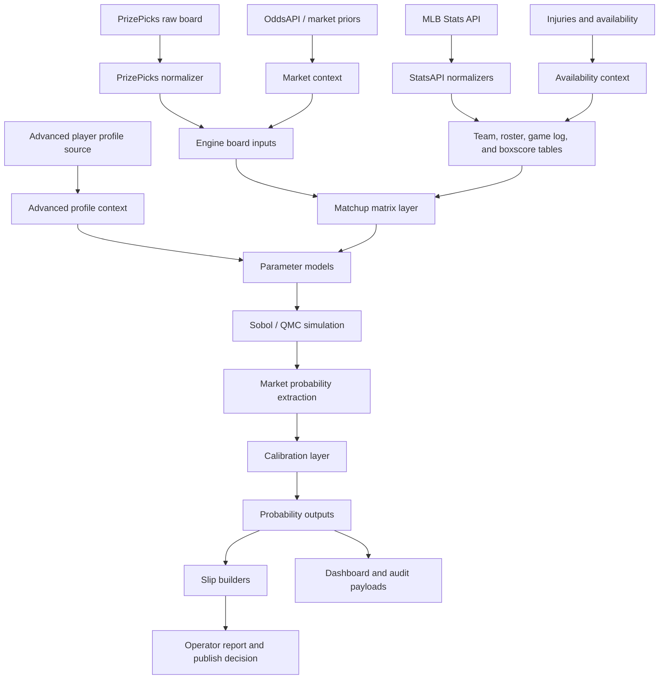
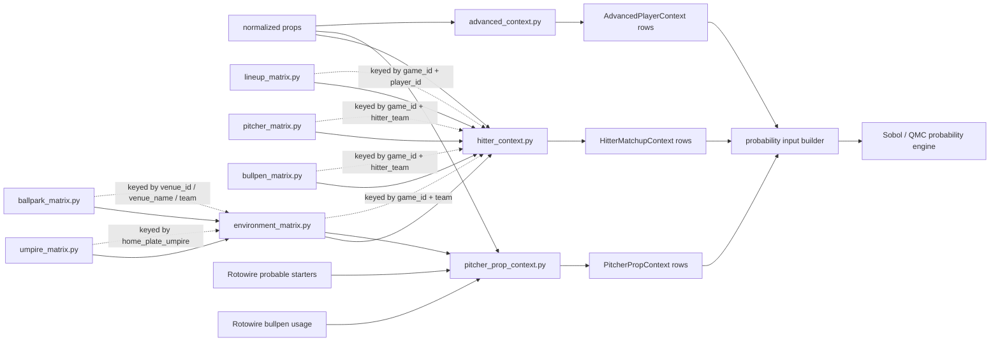
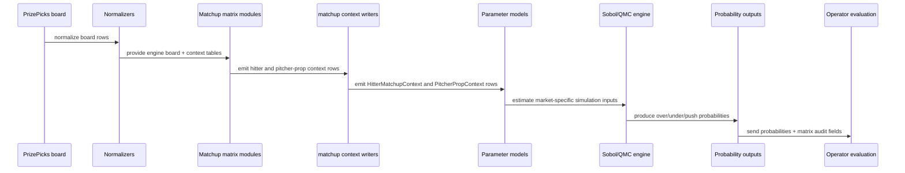
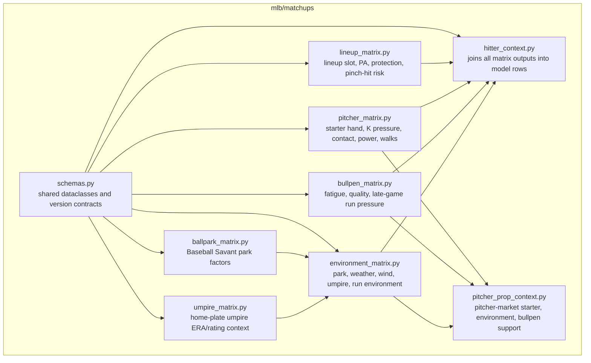

# Atlas MLB Matchup Matrix Architecture

Status: draft architecture with source-aware runtime artifacts  
Last updated: 2026-05-16

## Purpose

The matchup matrix is the baseball-specific replacement for the NBA share-matrix
idea. It does not produce final probabilities by itself. It produces structured
context that the Sobol / QMC probability engine consumes.

Core rule:

- Matrix modules produce features, confidence fields, and audit scores.
- `hitter_context.py` joins batter-facing modules into probability-ready hitter rows.
- `pitcher_prop_context.py` builds a separate pitcher-prop context so pitcher markets
  are not accidentally scored with hitter-facing signals.
- `advanced_context.py` is not a matchup matrix, but it is a sibling context
  layer. It stages source-neutral player profiles and adds hitter skill context
  before parameters are written.
- Probability outputs keep the decomposed matrix fields so every slate can be
  audited after the fact.

## Top-Level Data Flow



Why:

- PrizePicks defines the markets and lines that must be scored.
- StatsAPI, injury, and market context define the baseball state around those
  lines.
- The matrix layer converts raw baseball state into model-safe features.
- Advanced profile context adds source-neutral player skill priors such as
  expected contact, power, plate discipline, and strikeout pressure.
- The QMC engine turns those features into distributions and probabilities.

## Matrix Module Communication



Why:

- The matrix modules should not directly mutate each other.
- `hitter_context.py` is the hitter join point.
- `pitcher_prop_context.py` is the pitcher-market join point.
- `advanced_context.py` remains independent so profile data can be swapped
  without changing matrix joins.
- Each matrix remains independently testable and replayable.
- Missing context becomes explicit default fields instead of hidden failures.

## Runtime Sequence



Why:

- Runtime stays deterministic.
- Matrix fields are generated before parameter modeling.
- OpenAI/operator review can inspect matrix signals, but does not mutate
  probabilities.

## Module Responsibilities



Why:

- `schemas.py` prevents every module from inventing its own field names.
- Component modules stay narrow.
- `hitter_context.py` owns composition and market-aware weighting.

## Artifact Flow

```mermaid
flowchart TD
    A[data/mlb/staged/prizepicks] --> B[data/mlb/features/matchups/run_id]
    C[data/mlb/staged/statsapi] --> B
    D[data/mlb/staged/injuries] --> B
    E[data/mlb/staged/market] --> B

    B --> F[environment_context.csv/json]
    B --> G[lineup_context.csv/json]
    B --> H[pitcher_context.csv/json]
    B --> I[bullpen_context.csv/json]
    B --> J[hitter_matchup_context.csv/json]
    B --> P[pitcher_prop_context.csv/json]
    B --> K[matchup_matrix_manifest.json]

    J --> L[data/mlb/features/player_props/run_id/feature_table.csv]
    P --> L
    K --> M[data/mlb/<test_runs|live_runs>/run_id/run_manifest.json]
```

Why:

- Replay can load the exact matrix artifacts used for a run.
- Live and replay fidelity can be checked by comparing manifests.
- Dashboard and operator reports can explain why a leg was boosted or suppressed.

## Hitter Prop Context Contract

`hitter_context.py` should emit one row per scored hitter prop.

Required identity fields:

- `run_id`
- `game_id`
- `game_date`
- `source_projection_id`
- `player_id`
- `player_name`
- `team`
- `opponent`
- `market`
- `line`
- `tier`
- `direction`

Required matrix fields:

- `lineup_score`
- `starter_matchup_score`
- `bullpen_matchup_score`
- `environment_score`
- `matchup_composite_score`
- `matchup_confidence`
- `projected_plate_appearances`
- `batting_order_slot`
- `pinch_hit_risk`
- `strikeout_pressure_score`
- `contact_context_score`
- `power_context_score`
- `walk_context_score`
- `late_game_run_score`
- `park_run_factor`
- `park_hr_factor`
- `park_hit_factor`
- `park_extra_base_factor`
- `park_factor_confidence`
- `home_plate_umpire`
- `umpire_era`
- `umpire_rating`
- `umpire_run_score`
- `umpire_confidence`

Required audit fields:

- `matchup_matrix_version`
- `missing_context_flags`

Future audit fields once component sources are wired:

- `component_confidence`
- `source_snapshot_ids`

## Pitcher Prop Context Contract

`pitcher_prop_context.py` emits one row per scored pitcher prop. This path is
separate from `hitter_context.py` because starter quality, umpire run pressure,
workload risk, and run-allow context affect pitcher props differently than hitter
props.

Required identity fields:

- `run_id`
- `source_projection_id`
- `game_id`
- `game_date`
- `pitcher_id`
- `pitcher_name`
- `team`
- `opponent`
- `market`
- `line`
- `tier`
- `direction`

Required matrix fields:

- `starter_pitcher_name`
- `starter_hand`
- `starter_era`
- `starter_score`
- `strikeout_context_score`
- `workload_context_score`
- `run_allow_context_score`
- `walk_context_score`
- `opponent_lineup_score`
- `opponent_k_context_score`
- `opponent_contact_context_score`
- `opponent_power_context_score`
- `opponent_walk_context_score`
- `opponent_projected_pa`
- `opponent_top_order_pa`
- `opponent_confirmed_batters`
- `opponent_lineup_confidence`
- `pitcher_history_k_score`
- `pitcher_history_hit_allow_score`
- `pitcher_history_walk_score`
- `pitcher_history_confidence`
- `bullpen_support_score`
- `environment_score`
- `pitcher_prop_composite_score`
- `pitcher_prop_confidence`
- `home_plate_umpire`
- `umpire_era`
- `umpire_rating`
- `umpire_run_score`

Current rule:

- Pitcher props use this context only when the pitcher source row is present.
- `mlb_matchup_matrix_v1` adds opponent projected lineup shape, opponent hitter
  advanced/history signals, pitcher recent history, bullpen support, weather,
  park, and umpire context.
- The probability target shift remains capped and config-driven because this
  layer must prove itself in LODO before it can dominate the CAT stack.
- Rows with only ERA context carry `pitcher_prop_era_only_context` in
  `missing_context_flags` so future Savant/StatsAPI expansion is visible.

## Runnable Artifact Command

The current implementation locks the artifact contract before real lineup,
starter, bullpen, and environment feeds are wired.

Build from the latest engine board:

```powershell
py -m mlb.cli prepare matchups --date 2026-05-15
```

Build from an explicit engine board:

```powershell
py -m mlb.cli prepare matchups --engine-board data/mlb/staged/engine_board/latest.json --date 2026-05-15
```

Normalize a captured umpire table:

```powershell
py -m mlb.cli prepare umpires --source Umps.txt --run-id 2026-05-15
```

Normalize captured Baseball Savant ballpark factors:

```powershell
py -m mlb.cli prepare ballparks --source ballpark_factors.csv --run-id 2026
```

Outputs:

- `data/mlb/features/matchups/{run_id}/hitter_matchup_context.csv`
- `data/mlb/features/matchups/{run_id}/hitter_matchup_context.json`
- `data/mlb/features/matchups/{run_id}/pitcher_prop_context.csv`
- `data/mlb/features/matchups/{run_id}/pitcher_prop_context.json`
- `data/mlb/features/matchups/{run_id}/matchup_manifest.json`
- `data/mlb/features/matchups/latest.csv`
- `data/mlb/features/matchups/latest.json`
- `data/mlb/features/matchups/latest_pitcher_prop_context.csv`
- `data/mlb/features/matchups/latest_pitcher_prop_context.json`
- `data/mlb/features/matchups/latest_manifest.json`
- `data/mlb/staged/umpires/{run_id}/umpire_profiles.csv`
- `data/mlb/staged/umpires/{run_id}/umpire_profiles.json`
- `data/mlb/staged/umpires/{run_id}/umpire_profiles_manifest.json`
- `data/mlb/staged/ballparks/{run_id}/ballpark_profiles.csv`
- `data/mlb/staged/ballparks/{run_id}/ballpark_profiles.json`
- `data/mlb/staged/ballparks/{run_id}/ballpark_profiles_manifest.json`

Current component source status:

- `lineup`: `Rotowire batting orders wired`
- `pitcher`: `Rotowire probable starters wired`
- `pitcher_props`: `matchup_matrix_v1 wired; starter, opponent lineup, player-history, advanced profile, bullpen, environment, and umpire signals consumed`
- `bullpen`: `Rotowire bullpen usage wired`
- `environment`: `Rotowire weather/umpire text wired`
- `ballparks`: `staged_adapter_ready`
- `umpires`: `staged_adapter_ready and consumed when staged`

This means live output should carry explicit `missing_context_flags` only for
source gaps that are actually missing for the slate.

## Probability Output Contract

Probability output rows should keep matrix fields instead of collapsing them
away.

Minimum probability fields:

- `over_probability`
- `under_probability`
- `push_probability`
- `model_probability`
- `recommended_side`
- `mean_projection`
- `median_projection`
- `p10`
- `p25`
- `p75`
- `p90`
- `simulation_n`
- `simulation_seed`

Minimum matrix audit fields:

- `matchup_matrix_version`
- `lineup_score`
- `starter_matchup_score`
- `bullpen_matchup_score`
- `environment_score`
- `matchup_composite_score`
- `matchup_confidence`
- `missing_context_flags`

## Communication Rules

- Matrix modules never call the slip builder.
- Matrix modules never publish dashboard payloads.
- Matrix modules never settle outcomes.
- Matrix modules never call OpenAI.
- `hitter_context.py` is allowed to join matrix outputs, but not to create final
  probabilities.
- The probability engine consumes context rows and owns probability math.
- Operator AI sees matrix outputs only after deterministic scoring is complete.

## Initial Implementation Path

1. Create the `matchups/` package and schema contracts.
2. Emit deterministic placeholder matrix rows from normalized board/context data.
3. Join those rows into `HitterMatchupContext`.
4. Add matrix fields to the player-prop feature table.
5. Feed context rows into market-specific parameter models.
6. Promote the old `build_share_matrix` pipeline stage to
   `build_matchup_matrix` once live/replay tests agree.
